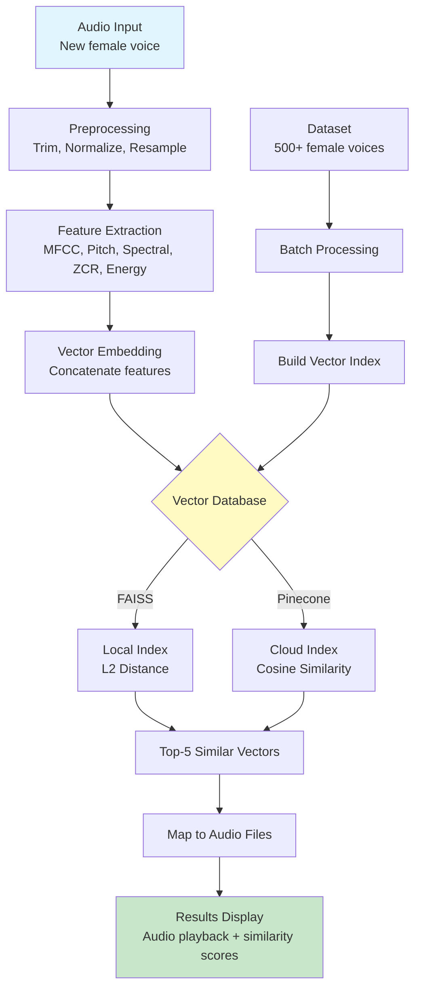

# Hệ thống Tìm kiếm Giọng nói Phụ nữ dựa trên Độ tương đồng

## 📋 Tổng quan

Xây dựng hệ thống tìm kiếm âm thanh giọng nói phụ nữ sử dụng **similarity search** với vector embeddings. Hệ thống nhận đầu vào là file âm thanh giọng phụ nữ, trả về 5 file âm thanh tương đồng nhất theo thứ tự giảm dần.

**Mục tiêu học thuật:**

- Thu thập/xây dựng dataset ≥500 files âm thanh giọng phụ nữ
- Trích xuất đặc trưng âm thanh (pitch, MFCC, spectral features)
- Xây dựng CSDL vector cho similarity search
- Demo hệ thống với giao diện Streamlit
- Đánh giá kết quả tìm kiếm

---

## 🎯 Tiêu chí thành công

| Tiêu chí               | Mục tiêu                                                  |
| ---------------------- | --------------------------------------------------------- |
| **Dataset**            | ≥500 files âm thanh giọng phụ nữ, cùng độ dài             |
| **Feature Extraction** | Có ≥5 đặc trưng âm thanh (pitch, MFCC, spectral, etc.)    |
| **Vector DB**          | Lưu trữ embeddings với FAISS/Pinecone                     |
| **Search Accuracy**    | Top-5 results có độ tương đồng hợp lý (manual evaluation) |
| **Demo UI**            | Streamlit app hoạt động, upload file → hiển thị top-5     |
| **Documentation**      | Sơ đồ hệ thống, giải thích feature extraction             |

---

## 🛠️ Tech Stack

| Component                | Technology                               | Lý do lựa chọn                                |
| ------------------------ | ---------------------------------------- | --------------------------------------------- |
| **Backend**              | Python 3.10+                             | Hệ sinh thái mạnh cho audio processing        |
| **Frontend**             | Streamlit                                | Nhanh chóng tạo UI demo, phù hợp MVP          |
| **Audio Processing**     | librosa, pydub, soundfile                | Standard libraries cho feature extraction     |
| **Vector DB (Primary)**  | FAISS                                    | Local, miễn phí, nhanh, phù hợp research      |
| **Vector DB (Optional)** | Pinecone                                 | Cloud-based, scalable (có thể dùng free tier) |
| **Feature Extraction**   | librosa (MFCC, pitch, spectral)          | Industry standard                             |
| **Environment**          | Conda (`voice-search`)                   | Quản lý dependencies dễ dàng                  |
| **Data Download**        | yt-dlp, requests, datasets (HuggingFace) | Thu thập audio từ nhiều nguồn                 |

---

## 📁 Cấu trúc thư mục dự án

```
Female-voice-similarity-search/
├── data/
│   ├── raw/                    # Audio files tải về (500+ files)
│   ├── processed/              # Audio sau khi normalize/trim
│   └── metadata.csv            # Thông tin files: path, duration, source
│
├── database/
│   ├── vectors/                # FAISS index files
│   ├── features.npy            # Feature vectors (n_samples × n_features)
│   └── index_mapping.json      # Mapping: vector_id → audio_path
│
├── src/
│   ├── data_collection/
│   │   ├── download_audio.py       # Công cụ tải audio từ nhiều nguồn
│   │   └── preprocess_audio.py     # Normalize, trim, resample
│   │
│   ├── feature_extraction/
│   │   ├── extractor.py            # Feature extraction pipeline
│   │   └── features_config.py      # Config: MFCC params, pitch range
│   │
│   ├── vector_database/
│   │   ├── faiss_manager.py        # FAISS index CRUD
│   │   └── pinecone_manager.py     # Pinecone integration (optional)
│   │
│   ├── search/
│   │   └── similarity_search.py    # Search pipeline: audio → features → top-k
│   │
│   └── utils/
│       ├── audio_utils.py          # Helper functions
│       └── visualization.py        # Waveform, spectrogram plots
│
├── app/
│   └── streamlit_app.py        # Main Streamlit UI
│
├── notebooks/
│   ├── 01_data_exploration.ipynb       # EDA: dataset statistics
│   ├── 02_feature_analysis.ipynb       # Feature importance analysis
│   └── 03_search_evaluation.ipynb     # Đánh giá kết quả tìm kiếm
│
├── tests/
│   ├── test_feature_extraction.py
│   └── test_search_pipeline.py
│
├── docs/
│   ├── system_architecture.md      # Sơ đồ hệ thống
│   ├── feature_extraction.md       # Giải thích các features
│   └── evaluation_report.md        # Báo cáo đánh giá
│
├── environment.yml             # Conda environment spec
├── requirements.txt            # Python dependencies
└── README.md
```

---

## Kiến trúc hệ thống



### Quy trình hoạt động

1. **Offline: Xây dựng database**
    - Tải 500+ audio files → `data/raw/`
    - Preprocessing: trim silence, normalize volume, resample to 16kHz
    - Extract features cho mỗi file → feature vectors (chiều ~128-256)
    - Build FAISS index và lưu mapping

2. **Online: Similarity search**
    - User upload audio file mới
    - Preprocess → Extract features
    - Query FAISS index → Top-5 nearest neighbors
    - Trả về file paths + similarity scores
    - Streamlit hiển thị kết quả (audio player, waveform, scores)

---

## Chi tiết các đặc trưng âm thanh (Features)

| Feature                | Mô tả                                              | Kích thước          | Thư viện                             |
| ---------------------- | -------------------------------------------------- | ------------------- | ------------------------------------ |
| **MFCC**               | Mel-Frequency Cepstral Coefficients (voice timbre) | 13-40 coeffs        | `librosa.feature.mfcc`               |
| **Pitch (F0)**         | Fundamental frequency (cao độ giọng nói)           | Mean, Std, Min, Max | `librosa.pyin` hoặc `parselmouth`    |
| **Spectral Centroid**  | Trọng tâm phổ tần số (brightness)                  | Mean, Std           | `librosa.feature.spectral_centroid`  |
| **Spectral Rolloff**   | Tần số mà dưới đó có 85% năng lượng                | Mean, Std           | `librosa.feature.spectral_rolloff`   |
| **Zero Crossing Rate** | Tốc độ đổi dấu tín hiệu (noisiness)                | Mean, Std           | `librosa.feature.zero_crossing_rate` |
| **RMS Energy**         | Năng lượng tín hiệu                                | Mean, Std           | `librosa.feature.rms`                |
| **Chroma**             | Phân bố năng lượng theo 12 pitch classes           | 12 values           | `librosa.feature.chroma_stft`        |

**Tổng số features:** ~40-80 dimensions (tuỳ config)

**Lý do lựa chọn:**

- **MFCC**: Standard cho voice recognition, nắm bắt timbre
- **Pitch**: Đặc trưng then chốt để phân biệt giọng nói
- **Spectral features**: Mô tả chất lượng âm thanh
- **Energy/ZCR**: Phân biệt voiced/unvoiced segments

---

## 📝 Task Breakdown - Phase by Phase

### **PHASE 1: Environment Setup**

#### Task 1.1: Tạo Conda Environment

- **Agent:** DevOps / Setup
- **Input:** `environment.yml` spec
- **Output:** Conda env `voice-search` activated
- **Verify:** `conda env list` hiển thị `voice-search`

```bash
conda create -n voice-search python=3.10 -y
conda activate voice-search
pip install streamlit librosa pydub soundfile numpy pandas faiss-cpu pinecone-client yt-dlp
```

#### Task 1.2: Tạo cấu trúc thư mục

- **Agent:** DevOps
- **Input:** Folder structure specification
- **Output:** Tất cả folders được tạo trong project root
- **Verify:** `tree` command hoặc `ls -R` show full structure

---

### **PHASE 2: Data Collection**

#### Task 2.1: Build Audio Download Tool

- **Agent:** `backend-specialist`
- **Skill:** `python-patterns`
- **Input:** Danh sách nguồn datasets (VoxCeleb, Common Voice, YouTube)
- **Output:** `src/data_collection/download_audio.py`
- **Features:**
    - Download từ HuggingFace `datasets` (VoxCeleb subset)
    - Download từ YouTube với `yt-dlp` (female voice channels)
    - Filter chỉ giọng phụ nữ (metadata hoặc manual curation)
- **Verify:** Run script → download ít nhất 50 files thử nghiệm

**Gợi ý datasets:**

- [VoxCeleb2](https://www.robots.ox.ac.uk/~vgg/data/voxceleb/vox2.html): Celebrity voices (có female subset)
- [Common Voice](https://commonvoice.mozilla.org/vi): Crowdsourced, có filter gender
- [LibriSpeech](http://www.openslr.org/12/): Audiobooks (có female speakers)

#### Task 2.2: Collect 500+ Audio Files

- **Agent:** Manual + Script
- **Input:** Download script + dataset URLs
- **Output:** `data/raw/` chứa ≥500 `.wav` files + `metadata.csv`
- **Verify:**
    - `len(os.listdir('data/raw'))` >= 500
    - `pandas.read_csv('data/metadata.csv').shape[0]` >= 500

#### Task 2.3: Audio Preprocessing

- **Agent:** `backend-specialist`
- **Input:** Raw audio files (có thể khác sample rate, độ dài)
- **Output:** `data/processed/` với files đồng nhất (16kHz, 3-5s duration)
- **Script:** `src/data_collection/preprocess_audio.py`
- **Verify:**
    - All files in `processed/` có cùng sample rate (16000 Hz)
    - Duration variance < 0.5s

**Preprocessing steps:**

```python
# Pseudo-code
for audio_file in raw_files:
    audio, sr = librosa.load(audio_file, sr=16000)  # Resample
    audio = librosa.effects.trim(audio)[0]           # Trim silence
    audio = librosa.util.normalize(audio)            # Normalize volume

    # Chọn segment cố định (e.g., 3 seconds)
    target_length = 3 * 16000  # 3s × 16kHz
    if len(audio) > target_length:
        audio = audio[:target_length]  # Crop
    else:
        audio = np.pad(audio, (0, target_length - len(audio)))  # Pad

    soundfile.write(f'processed/{filename}', audio, 16000)
```

---

### **PHASE 3: Feature Extraction**

#### Task 3.1: Design Feature Extraction Pipeline

- **Agent:** `backend-specialist`
- **Skill:** `python-patterns`, audio processing knowledge
- **Input:** Preprocessed audio files
- **Output:** `src/feature_extraction/extractor.py`
- **Functions:**
    - `extract_mfcc(audio, sr)` → shape (13,)
    - `extract_pitch_features(audio, sr)` → shape (4,) # mean, std, min, max
    - `extract_spectral_features(audio, sr)` → shape (6,)
    - `extract_all_features(audio_path)` → shape (40,)
- **Verify:**
    - Test với 1 file → vector shape = (40,)
    - No NaN values in output

#### Task 3.2: Batch Extract Features for All Audio

- **Agent:** Script execution
- **Input:** `data/processed/` (500+ files)
- **Output:**
    - `database/features.npy` shape (500, 40)
    - `database/index_mapping.json` {0: "file1.wav", 1: "file2.wav", ...}
- **Script:** Sử dụng `extractor.py` với multiprocessing
- **Verify:**
    - `features.npy` shape matches số lượng files
    - No missing entries in `index_mapping.json`

```python
# Pseudo-code
features_list = []
mapping = {}

for idx, audio_file in enumerate(processed_files):
    features = extract_all_features(audio_file)
    features_list.append(features)
    mapping[idx] = audio_file

np.save('database/features.npy', np.array(features_list))
json.dump(mapping, open('database/index_mapping.json', 'w'))
```

---

### **PHASE 4: Vector Database Setup**

#### Task 4.1: Build FAISS Index

- **Agent:** `backend-specialist`
- **Skill:** `database-design`
- **Input:** `database/features.npy`
- **Output:** `database/vectors/faiss_index.bin`
- **Script:** `src/vector_database/faiss_manager.py`

```python
import faiss
import numpy as np

# Load features
features = np.load('database/features.npy').astype('float32')
dimension = features.shape[1]  # 40

# Create FAISS index (L2 distance)
index = faiss.IndexFlatL2(dimension)
index.add(features)  # Add all vectors

# Save index
faiss.write_index(index, 'database/vectors/faiss_index.bin')
```

- **Verify:**
    - `index.ntotal` == số lượng audio files
    - Test search với 1 vector → trả về indices hợp lệ

#### Task 4.2: (Optional) Setup Pinecone

- **Agent:** `backend-specialist`
- **Input:** Pinecone API key, features array
- **Output:** Pinecone index với all vectors uploaded
- **Script:** `src/vector_database/pinecone_manager.py`
- **Verify:** Query Pinecone index → trả về kết quả

> **Note:** FAISS là primary, Pinecone optional cho comparison

---

### **PHASE 5: Similarity Search Pipeline**

#### Task 5.1: Build Search Module

- **Agent:** `backend-specialist`
- **Input:** Query audio file + FAISS index
- **Output:** `src/search/similarity_search.py`
- **Functions:**
    - `search_similar(query_audio_path, top_k=5)` → List[(file_path, similarity_score)]

```python
def search_similar(query_audio_path, top_k=5):
    # 1. Extract features from query audio
    query_features = extract_all_features(query_audio_path)
    query_vector = query_features.reshape(1, -1).astype('float32')

    # 2. Load FAISS index
    index = faiss.read_index('database/vectors/faiss_index.bin')

    # 3. Search
    distances, indices = index.search(query_vector, top_k)

    # 4. Map to file paths
    mapping = json.load(open('database/index_mapping.json'))
    results = [
        (mapping[str(idx)], float(dist))
        for idx, dist in zip(indices[0], distances[0])
    ]

    return results
```

- **Verify:**
    - Test với audio từ database → top-1 phải là chính nó (distance ≈ 0)
    - Test với audio mới → trả về 5 kết quả hợp lý

---

### **PHASE 6: Streamlit UI**

#### Task 6.1: Build Streamlit App

- **Agent:** `frontend-specialist` hoặc `backend-specialist`
- **Skill:** `clean-code`
- **Input:** Search pipeline + audio files
- **Output:** `app/streamlit_app.py`

**UI Features:**

1. **Upload Section:**
    - File uploader (accept `.wav`, `.mp3`, `.flac`)
    - Display uploaded audio waveform

2. **Search Results:**
    - Show top-5 similar audio files
    - For each result:
        - Audio player
        - Similarity score (normalized 0-100%)
        - Waveform plot
        - File name

3. **System Info:**
    - Total files in database
    - Feature dimensions
    - Database type (FAISS/Pinecone)

```python
import streamlit as st
from search.similarity_search import search_similar
import librosa
import librosa.display
import matplotlib.pyplot as plt

st.title("🎤 Hệ thống Tìm kiếm Giọng nói Phụ nữ")

# Upload
uploaded_file = st.file_uploader("Tải lên file âm thanh giọng phụ nữ", type=['wav', 'mp3'])

if uploaded_file:
    # Save temp file
    with open('temp_query.wav', 'wb') as f:
        f.write(uploaded_file.read())

    # Display query audio
    st.subheader("Âm thanh tìm kiếm:")
    st.audio('temp_query.wav')

    # Search
    with st.spinner('Đang tìm kiếm...'):
        results = search_similar('temp_query.wav', top_k=5)

    # Display results
    st.subheader("🔍 Top 5 kết quả tương đồng:")
    for rank, (file_path, distance) in enumerate(results, 1):
        st.write(f"**#{rank} - Độ tương đồng: {100 - distance:.2f}%**")
        st.audio(file_path)

        # Waveform
        audio, sr = librosa.load(file_path)
        fig, ax = plt.subplots()
        librosa.display.waveshow(audio, sr=sr, ax=ax)
        st.pyplot(fig)
        st.write("---")
```

- **Verify:**
    - Run `streamlit run app/streamlit_app.py`
    - Upload audio → See 5 results with playback

---

### **PHASE 7: Documentation**

#### Task 7.1: System Architecture Document

- **Agent:** Documentation
- **Output:** `docs/system_architecture.md`
- **Content:**
    - Sơ đồ khối hệ thống (Mermaid diagram)
    - Quy trình xử lý: Input → Features → Search → Output
    - Giải thích từng module

#### Task 7.2: Feature Extraction Explanation

- **Output:** `docs/feature_extraction.md`
- **Content:**
    - Giải thích chi tiết từng loại feature
    - Lý do lựa chọn
    - Công thức toán học (MFCC, pitch detection)
    - Ví dụ minh hoạ (plots)

#### Task 7.3: Evaluation Report

- **Output:** `docs/evaluation_report.md`
- **Content:**
    - Thống kê dataset (số lượng files, độ dài trung bình, phân bố)
    - Đánh giá kết quả tìm kiếm (manual evaluation với 10-20 queries)
    - Phân tích độ chính xác: Top-5 có giọng tương đồng không?
    - Kết luận và hướng cải thiện

---

## PHASE X: VERIFICATION (Final Checklist)

> 🔴 **Thực thi các bước này TRƯỚC KHI đánh dấu project hoàn thành**

### X.1: Functional Tests

- [ ] **Dataset:** Có ≥500 files trong `data/processed/`, cùng độ dài
- [ ] **Feature Extraction:**
    - Run `test_feature_extraction.py` → All tests pass
    - Verify: features.npy không có NaN
- [ ] **FAISS Index:**
    - Load index thành công
    - Search với 1 audio trong database → top-1 là chính nó
- [ ] **Search Pipeline:**
    - Test với 5 query audios khác nhau
    - Mỗi query trả về 5 kết quả hợp lý (manual check)
- [ ] **Streamlit UI:**
    - App khởi động không lỗi: `streamlit run app/streamlit_app.py`
    - Upload audio → hiển thị 5 results với audio playback
    - Waveform plots render đúng

### X.2: Code Quality

```bash
# Lint check
# turbo
python -m pylint src/ app/ --disable=C0111,R0903

# Type hints check (if used)
# turbo
python -m mypy src/ app/ --ignore-missing-imports
```

- [ ] No critical linting errors
- [ ] Code follows clean-code principles (src readable, modular)

### X.3: Security Scan

```bash
# turbo
python .agent/skills/vulnerability-scanner/scripts/security_scan.py .
```

- [ ] No hardcoded API keys
- [ ] No critical vulnerabilities in dependencies

### X.4: Documentation Complete

- [ ] `README.md` có hướng dẫn cài đặt và chạy
- [ ] `docs/system_architecture.md` có sơ đồ hệ thống
- [ ] `docs/feature_extraction.md` giải thích các features
- [ ] `docs/evaluation_report.md` có đánh giá kết quả

### X.5: Demo Ready

- [ ] Chuẩn bị 3-5 audio samples để demo trực tiếp
- [ ] Chạy search với các samples → kết quả hợp lý
- [ ] Screenshots hoặc video demo UI

---

## 📚 Dependencies & Installation

**Conda environment:**

```bash
conda create -n voice-search python=3.10 -y
conda activate voice-search
```

**Core packages** (`requirements.txt`):

```
streamlit>=1.28.0
librosa>=0.10.0
soundfile>=0.12.0
pydub>=0.25.0
numpy>=1.24.0
pandas>=2.0.0
faiss-cpu>=1.7.4        # hoặc faiss-gpu nếu có GPU
pinecone-client>=2.2.0  # optional
yt-dlp>=2023.0.0
matplotlib>=3.7.0
scikit-learn>=1.3.0     # for evaluation metrics
datasets>=2.14.0        # HuggingFace datasets
```

**Install:**

```bash
pip install -r requirements.txt
```

---

## 🚀 Quick Start Guide

```bash
# 1. Setup environment
conda create -n voice-search python=3.10 -y
conda activate voice-search
pip install -r requirements.txt

# 2. Download dataset
python src/data_collection/download_audio.py --source voxceleb --samples 500

# 3. Preprocess audio
python src/data_collection/preprocess_audio.py

# 4. Extract features
python src/feature_extraction/extractor.py --batch-process

# 5. Build FAISS index
python src/vector_database/faiss_manager.py --build-index

# 6. Run Streamlit app
streamlit run app/streamlit_app.py
```

---

## 🔬 Evaluation Metrics

Để đánh giá chất lượng tìm kiếm:

1. **Manual Evaluation:**
    - Chọn 20 audio queries
    - Với mỗi query, kiểm tra top-5 results
    - Đánh giá: Có bao nhiêu results thực sự tương đồng (subjective)

2. **Precision@5:**
    - Nếu có ground truth (cùng speaker)
    - P@5 = (số kết quả đúng trong top-5) / 5

3. **Feature Importance Analysis:**
    - Thử nghiệm loại bỏ từng nhóm features
    - Xem feature nào ảnh hưởng nhiều nhất đến kết quả

---

## 📖 References & Resources

**Datasets:**

- [VoxCeleb](https://www.robots.ox.ac.uk/~vgg/data/voxceleb/)
- [Common Voice](https://commonvoice.mozilla.org/)
- [LibriSpeech](http://www.openslr.org/12/)

**Audio Feature Extraction:**

- [librosa Documentation](https://librosa.org/doc/latest/index.html)
- [Audio Signal Processing for ML](https://www.youtube.com/playlist?list=PLhA3b2k8R3t2Ng1WW_7MiXeh1pfQJQi_P)

**Vector Similarity Search:**

- [FAISS Documentation](https://github.com/facebookresearch/faiss/wiki)
- [Pinecone Docs](https://docs.pinecone.io/)

**MFCC & Voice Features:**

- [Understanding MFCCs](https://medium.com/prathena/the-dummys-guide-to-mfcc-aceab2450fd)
- [Voice Feature Extraction](https://www.sciencedirect.com/topics/computer-science/voice-feature-extraction)

---

## 🎯 Next Steps After Planning

1. **Review Plan:** Người dùng review và approve kế hoạch
2. **Phase 3 (SOLUTIONING):** Thiết kế chi tiết feature extraction pipeline
3. **Phase 4 (IMPLEMENTATION):** Bắt đầu code theo task breakdown
4. **Phase X (VERIFICATION):** Chạy tests và demo

---

## Plan Status

- [x] Requirements analysis complete
- [x] Tech stack decided
- [x] File structure defined
- [x] Task breakdown created
- [ ] User approval pending

**Created:** 2026-01-29  
**Last Updated:** 2026-01-29  
**Plan File:** `voice-similarity-search.md`
